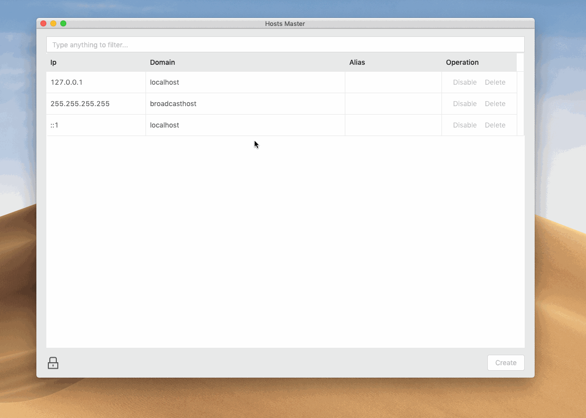

# hosts


![][david-url]

This is a tiny tool for quick managing hosts file



## Permission

Since modifying hosts file require root privileges, you may need to approve it once authentication dialog displayed.

# Download

* Windows: [64bit](https://github.com/leftstick/hosts-high/releases/download/2.0.5/hosthigh-2.0.5-win64.zip)
* Mac 11.11+: [64bit](https://github.com/leftstick/hosts-high/releases/download/2.0.5/hosthigh-2.0.5-darwin.zip)
* Linux: [64bit](https://github.com/leftstick/hosts-high/releases/download/2.0.5/hosthigh-2.0.5-linux.zip)

## How To Contribute

> clone repo first

```bash
npm install
npm start
```

> once code changed, you may need `ctrl/cmd + shift + r` to reload it.

## LICENSE

[mit license]: (https://raw.githubusercontent.com/leftstick/hosts-high/master/LICENSE)
[david-url]: https://david-dm.org/leftstick/hosts-high.png
