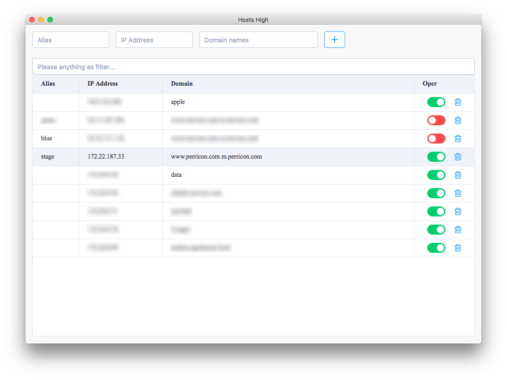

hosts
====================


![][david-url]

This is a tiny tool for quick managing hosts file



## Known Issue ##

### permission ###

You have to give write permission to `/etc/hosts` first, otherwise, It's not possible to modify `/etc/hosts`.

>I know this is really bad, if you have better way to ask for permission every time when user launch the app, feel free give me a PR

## How To Contribute ##

>clone repo first

```bash
npm install
npm run watch //continuously watch the code change, and output new bundle
```

Start a new terminal session:

```bash
npm start //launch Hosts GUI
```


## LICENSE ##

[MIT License](https://raw.githubusercontent.com/leftstick/hosts-high/master/LICENSE)
[david-url]: https://david-dm.org/leftstick/hosts-high.png
